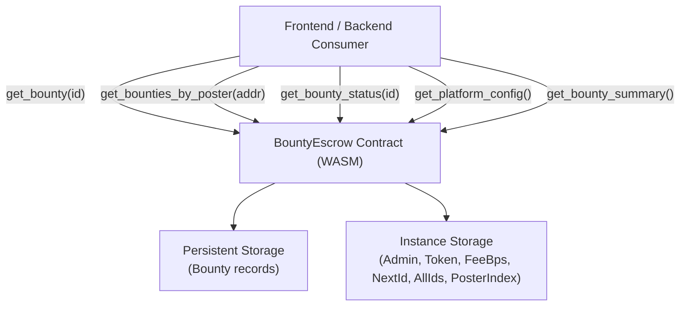

# Design Document: bounty-escrow-reads

## Overview

This design adds a complete set of public read-only methods to the `bounty-escrow` Soroban smart contract. The contract is written in Rust targeting the Soroban SDK 25.x and follows the same four-file layout used by sibling contracts in this workspace (`lib.rs`, `storage.rs`, `types.rs`, `test.rs`).

The read methods expose bounty state, poster-scoped views, status snapshots, platform configuration, and aggregate statistics. All methods return named structs rather than tuples, handle missing/unconfigured state without panicking, and leave every existing write path and storage key untouched.

---

## Architecture

The contract is a single Soroban WASM binary. There is no off-chain indexer involved; all reads are satisfied directly from on-chain persistent and instance storage.



---

## Components and Interfaces

### `lib.rs` — Public Contract Methods

All five read methods are added to the existing `#[contractimpl]` block. They are `pub fn` with `&self` semantics (no `mut` needed) and take `Env` by value as required by Soroban.

```rust
pub fn get_bounty(env: Env, bounty_id: u64) -> BountyView
pub fn get_bounties_by_poster(env: Env, poster: Address) -> Vec<BountyView>
pub fn get_bounty_status(env: Env, bounty_id: u64) -> BountyStatusView
pub fn get_platform_config(env: Env) -> PlatformConfigView
pub fn get_bounty_summary(env: Env) -> BountySummary
```

None of these methods call `require_auth()`.

### `storage.rs` — Storage Helpers

New helpers added alongside existing ones:

```rust
// Retrieve a single bounty record (already exists or will be added)
pub fn get_bounty(env: &Env, bounty_id: u64) -> Option<BountyRecord>

// Retrieve all bounty IDs (reuses AllIds aggregate)
pub fn get_all_ids(env: &Env) -> Vec<u64>

// Retrieve the poster index: maps poster Address -> Vec<u64> of bounty IDs
pub fn get_poster_index(env: &Env, poster: &Address) -> Vec<u64>

// Append a bounty_id to the poster index (called from write path)
pub fn push_poster_index(env: &Env, poster: &Address, bounty_id: u64)
```

The `PosterIndex(Address)` key is added to `DataKey`. It is populated by the existing `post_bounty` write path (or equivalent) so reads are O(1) per poster lookup rather than a full scan.

### `types.rs` — Named Response Types

Five new `#[contracttype]` structs are added. All existing types are preserved.

---

## Data Models

### Existing `DataKey` variants (preserved, not modified)

```rust
Admin,
Token,
FeeBps,
NextBountyId,
AllIds,
Bounty(u64),
```

### New `DataKey` variant

```rust
PosterIndex(Address),   // Vec<u64> of bounty IDs posted by this address
```

### `BountyRecord` (existing persistent storage struct)

```rust
#[contracttype]
pub struct BountyRecord {
    pub bounty_id: u64,
    pub poster: Address,
    pub reward: i128,
    pub status: BountyStatus,
    pub expiry_ledger: u32,
    pub description: Symbol,
}
```

### `BountyStatus` (existing enum)

```rust
#[contracttype]
#[derive(Clone, Debug, Eq, PartialEq)]
pub enum BountyStatus {
    Open,
    Paused,
    Completed,
    Cancelled,
}
```

### New response types

```rust
/// Full view of a single bounty. `exists: false` when bounty_id is unknown.
#[contracttype]
#[derive(Clone, Debug, Eq, PartialEq)]
pub struct BountyView {
    pub bounty_id: u64,
    pub exists: bool,
    pub poster: Option<Address>,
    pub reward: Option<i128>,
    pub status: Option<BountyStatus>,
    pub expiry_ledger: Option<u32>,
    pub description: Option<Symbol>,
}

/// Lightweight status-only view. `exists: false` when bounty_id is unknown.
/// Zero-state: status field is omitted (None) when exists is false.
#[contracttype]
#[derive(Clone, Debug, Eq, PartialEq)]
pub struct BountyStatusView {
    pub bounty_id: u64,
    pub exists: bool,
    pub status: Option<BountyStatus>,
}

/// Platform configuration view.
/// Zero-state: initialized = false, all Option fields = None when not yet init'd.
#[contracttype]
#[derive(Clone, Debug, Eq, PartialEq)]
pub struct PlatformConfigView {
    pub initialized: bool,
    pub admin: Option<Address>,
    pub token: Option<Address>,
    pub fee_bps: Option<u32>,
}

/// Aggregate statistics across all bounties.
/// Zero-state: all counts and total_escrowed = 0 when no bounties exist.
#[contracttype]
#[derive(Clone, Debug, Eq, PartialEq)]
pub struct BountySummary {
    pub open_count: u64,
    pub paused_count: u64,
    pub completed_count: u64,
    pub cancelled_count: u64,
    /// Sum of reward for Open + Paused bounties only.
    pub total_escrowed: i128,
}
```

---

## Correctness Properties

A property is a characteristic or behavior that should hold true across all valid executions of a system — essentially, a formal statement about what the system should do. Properties serve as the bridge between human-readable specifications and machine-verifiable correctness guarantees.

Property 1: get_bounty round-trip consistency
*For any* bounty that has been posted, calling `get_bounty` with its ID should return a `BountyView` where `exists` is `true` and all fields match the values that were stored during posting.
**Validates: Requirements 1.1**

Property 2: get_bounty missing-ID zero-state
*For any* `bounty_id` that has never been posted, calling `get_bounty` should return a `BountyView` with `exists: false` and every `Option` field set to `None`.
**Validates: Requirements 1.2, 7.1**

Property 3: get_bounties_by_poster completeness
*For any* poster address and any set of bounties posted by that address, calling `get_bounties_by_poster` should return a `Vec<BountyView>` whose length equals the number of bounties posted by that address, and every returned entry should have `poster == Some(address)`.
**Validates: Requirements 2.1, 2.4**

Property 4: get_bounties_by_poster empty result
*For any* address that has never posted a bounty, calling `get_bounties_by_poster` should return an empty `Vec`.
**Validates: Requirements 2.2**

Property 5: get_bounty_status consistency with get_bounty
*For any* bounty_id, the `status` field returned by `get_bounty_status` should equal the `status` field returned by `get_bounty` for the same ID (both `None` when the bounty does not exist).
**Validates: Requirements 3.1, 3.2**

Property 6: get_platform_config zero-state before init
*For any* freshly deployed contract that has not been initialized, calling `get_platform_config` should return a `PlatformConfigView` with `initialized: false` and all `Option` fields `None`.
**Validates: Requirements 4.2, 7.2**

Property 7: get_bounty_summary count invariant
*For any* set of bounties, the sum `open_count + paused_count + completed_count + cancelled_count` returned by `get_bounty_summary` should equal the total number of bounties that have been posted.
**Validates: Requirements 5.2**

Property 8: get_bounty_summary total_escrowed invariant
*For any* set of bounties, `total_escrowed` returned by `get_bounty_summary` should equal the sum of `reward` for all bounties whose status is `Open` or `Paused`.
**Validates: Requirements 5.3**

---

## Error Handling

| Situation | Behavior |
|---|---|
| `get_bounty` called with unknown ID | Returns `BountyView { exists: false, .. }` — no panic |
| `get_bounty_status` called with unknown ID | Returns `BountyStatusView { exists: false, status: None }` — no panic |
| `get_platform_config` called before `init` | Returns `PlatformConfigView { initialized: false, .. }` — no panic |
| `get_bounties_by_poster` called for address with no bounties | Returns empty `Vec` — no panic |
| `get_bounty_summary` called with no bounties | Returns all-zero `BountySummary` — no panic |

No new `contracterror` variants are needed for read methods because all error conditions are expressed as zero-state structs.

---

## Testing Strategy

### Dual Testing Approach

Unit tests (in `test.rs`) cover specific examples, edge cases, and error conditions. Property-based tests validate universal properties across many generated inputs.

### Unit Tests (in `test.rs`)

Each read method gets at minimum:
- A success-path test with a real bounty in storage.
- An empty/missing-state test verifying zero-state behavior.

Required unit test cases:
- `test_get_bounty_success` — post a bounty, read it back, assert all fields match.
- `test_get_bounty_missing` — read a never-posted ID, assert `exists: false`.
- `test_get_bounties_by_poster_success` — post two bounties from same poster, assert both returned.
- `test_get_bounties_by_poster_empty` — query address with no bounties, assert empty vec.
- `test_get_bounty_status_success` — post a bounty, read status, assert matches.
- `test_get_bounty_status_missing` — read status for unknown ID, assert `exists: false`.
- `test_get_platform_config_initialized` — init contract, read config, assert fields match.
- `test_get_platform_config_uninitialized` — read config before init, assert `initialized: false`.
- `test_get_bounty_summary_empty` — no bounties, assert all-zero summary.
- `test_get_bounty_summary_mixed_states` — post bounties in multiple states, assert counts and `total_escrowed`.

### Property-Based Tests

The Soroban test environment does not support an external PBT library (no `std`). Property-like coverage is achieved by parameterizing unit tests over multiple generated inputs using helper functions that create bounties with varied IDs, posters, rewards, and statuses. Each property listed in the Correctness Properties section maps to at least one such parameterized test.

Property test tag format: `// Feature: bounty-escrow-reads, Property N: <property_text>`

Minimum coverage per property: exercise at least 5 distinct input combinations.
