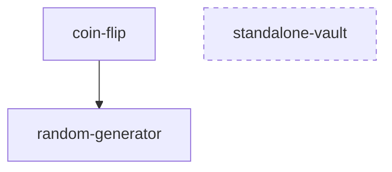

# Call Graph Visualizer CLI

A Node.js/TypeScript static analysis CLI that scans this repo's Soroban
smart contracts for cross-contract client invocations (the
`XyzClient::new(&env, &address)` pattern) and generates a directed
dependency diagram — Mermaid flowchart or Graphviz DOT — plus a per-contract
inward/outward call count summary.

## Features

- **Contract Discovery**: Treats every directory under `--contracts-dir`
  containing a `src/lib.rs` as one contract crate, and extracts its
  `#[contract] pub struct Name;` declaration
- **Cross-Contract Call Detection**: Finds `XyzClient::new(...)` call sites
  in each contract's `src/lib.rs`, resolving `XyzClient` back to the
  contract whose `#[contract]` struct is `Xyz` (skipping types that don't
  resolve to a discovered contract, and self-references)
- **Mermaid + DOT Export**: `--format mermaid` (default) or `--format dot`
- **Isolated Contract Highlighting**: Contracts with zero inward and zero
  outward calls are rendered with a dashed style and called out separately
- **Call Count Summary**: A Markdown table of inward/outward call counts per
  contract

## Installation

```bash
npm install
npm run build
```

## Usage

```bash
node dist/index.js [--contracts-dir <path>] [--format mermaid|dot] [--out <path>]
```

**Options:**
- `--contracts-dir <path>`: Directory of contract crates to scan (default: `contracts`, relative to cwd)
- `--format <mermaid|dot>`: Output diagram format (default: `mermaid`)
- `--out <path>`: Write the diagram to this file instead of stdout
- `--json`: Output the raw report (contracts, edges, isolated contracts, call counts) as JSON

### Examples

```bash
# Scan this repo's main contracts workspace from the repo root
node experimental/tools/call-graph-visualizer/dist/index.js --contracts-dir contracts

# Write a DOT file for `dot -Tsvg`
node dist/index.js --contracts-dir contracts --format dot --out call-graph.dot
dot -Tsvg call-graph.dot -o call-graph.svg
```

### Testing

```bash
npm test
```

## Detection Model

- Only `src/lib.rs` is scanned per contract, matching where every contract
  in this codebase declares its cross-contract client calls today. A
  contract calling out from a different module would not currently be
  detected — see Known Limitations below.
- A call site is recognized by the regex `(\w+Client)::new\s*\(`, applied
  line-by-line with `//` line comments stripped first so a commented-out
  call is not counted as a real edge.
- Detected client names are resolved against every discovered contract's
  `#[contract]` struct name (`Xyz` → `XyzClient`). A client type that
  doesn't match any discovered contract (e.g. `TokenClient` for the
  built-in Stellar Asset Contract, which isn't a crate under
  `contracts/`) is not rendered as an edge — this matches the issue's
  scope of mapping calls *between contracts in this workspace*.

## Sample Diagram

Generated by running the tool against a small fixture workspace with a
`coin-flip` contract that calls `random-generator`, and an isolated
`standalone-vault` contract with no cross-contract calls:



Call count summary for the same fixture:

| Contract | Inward Calls | Outward Calls |
|---|---|---|
| coin-flip | 0 | 1 |
| random-generator | 1 | 0 |
| standalone-vault | 0 | 0 |

## Known Limitations / Follow-ups

- Detection is a line-based regex scan, not a real Rust AST parse. It will
  miss a `Client::new` call split across multiple lines (e.g. the type name
  and `::new(` on different lines) and cannot distinguish a call inside a
  `#[cfg(test)]` block from production code. This mirrors the "regex/AST
  parser" wording in the issue's Required Tests section — a full
  `syn`-based parser would be a natural follow-up for higher precision.
- Only `src/lib.rs` is scanned; contracts that split cross-contract calls
  into a separate module file would need that module scanned too.
- This tool was authored and reviewed without running it against the full
  `contracts/` workspace in CI — run `npm test` (fixture-based, no real
  workspace dependency) plus a manual `--contracts-dir contracts` pass
  against this repo's real contracts before relying on its output for
  architecture decisions.

## License

MIT
